# ECS Multi-Container Deployment with Secrets Manager & IAM Task Roles

A hands-on AWS ECS (Fargate) project demonstrating a multi-container task, environment variable configuration, secure secrets injection via AWS Secrets Manager, and load-balanced service deployment.

  

---

## Architecture

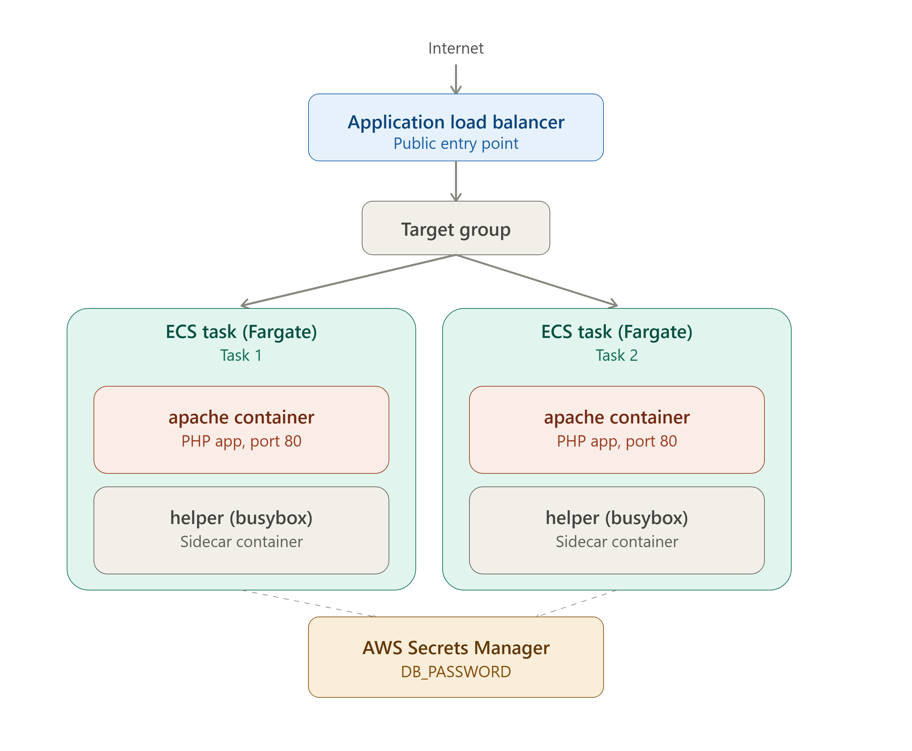

Traffic flows from the internet through the ALB and target group to two ECS Fargate tasks. Each task runs two containers — the main `apache` container and a `helper` (BusyBox) sidecar. Both tasks retrieve `DB_PASSWORD` from AWS Secrets Manager at startup via the Task Execution Role.

---

## Project Overview

This project deploys a simple PHP web application to **Amazon ECS (Fargate)** behind an **Application Load Balancer**, with two containers running side-by-side in a single ECS Task:

- **`apache`** — serves the PHP web app
- **`helper`** — a lightweight BusyBox **sidecar container** simulating a background/log-processing process

The app displays its configuration at runtime to prove that:
- Config values come from **environment variables** (not hardcoded)
- Sensitive values (like the DB password) come from **AWS Secrets Manager** (not hardcoded, not baked into the image)
- ECS is auto-healing (killing a task causes ECS to replace it automatically)
- The ALB load-balances across multiple running tasks (hostname changes on refresh)

---

## Key Concepts Covered

**Task Role** vs **Execution Role** · Sidecar containers · Env vars vs Secrets Manager · Task definition versioning · Self-healing

---

## Prerequisites

- AWS account with permissions for ECS, ECR, IAM, Secrets Manager, and ELB
- AWS CLI configured (`aws configure`)
- Docker installed locally
- Basic familiarity with PHP and Docker

---

## Project Structure

```
ecs-demo/
├── Dockerfile
├── index.php
└── README.md
```

---

## Step-by-Step Build Guide

### Step 1 — Create the project folder
```bash
mkdir ecs-demo && cd ecs-demo
```

### Step 2 — Write the PHP application
`index.php` reads configuration from environment variables — nothing is hardcoded.

```php
<?php
echo "<h1>Amazon ECS Demo</h1>";
echo "<hr>";
echo "<h2>Application Name</h2>";
echo getenv("APP_NAME");
echo "<br><br>";
echo "<h2>Database Password</h2>";
echo getenv("DB_PASSWORD");
echo "<br><br>";
echo "<h2>Hostname</h2>";
echo gethostname();
?>
```

### Step 3 — Write the Dockerfile
```dockerfile
FROM php:8.2-apache
COPY index.php /var/www/html/
EXPOSE 80
```

### Step 4 — Build the image
```bash
docker build -t ecs-demo .
docker images   # verify ecs-demo:latest exists
```

### Step 5 — Test locally
```bash
docker run -d -p 8080:80 \
  -e APP_NAME="Training Portal" \
  -e DB_PASSWORD="LocalPassword" \
  ecs-demo
```
Visit `http://localhost:8080` and confirm the app displays the app name, password, and container hostname.

> local browser output showing app name, password, and hostname
> 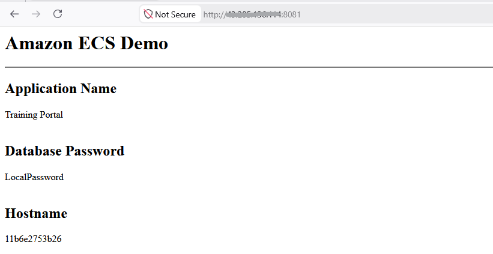

### Step 6 — Create an ECR repository
AWS Console → **ECR** → Create Repository → name it `ecs-demo` (private).

> repository created, empty (before push)
> 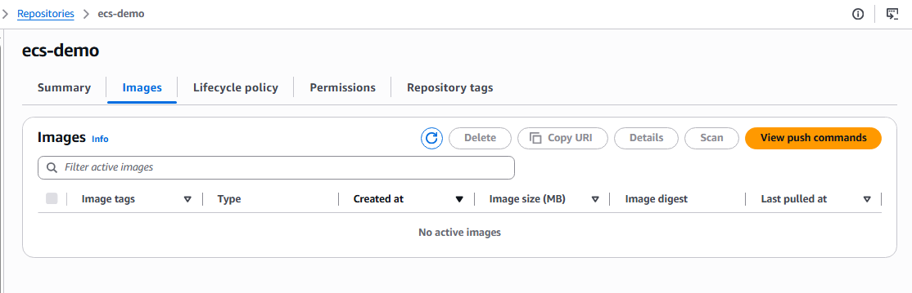

### Step 7 — Push the image to ECR
```bash
aws ecr get-login-password --region <your-region> | \
  docker login --username AWS --password-stdin <account-id>.dkr.ecr.<region>.amazonaws.com

docker tag ecs-demo:latest <account-id>.dkr.ecr.<region>.amazonaws.com/ecs-demo:latest
docker push <account-id>.dkr.ecr.<region>.amazonaws.com/ecs-demo:latest
```

> pushed image visible in the ECR repository
> 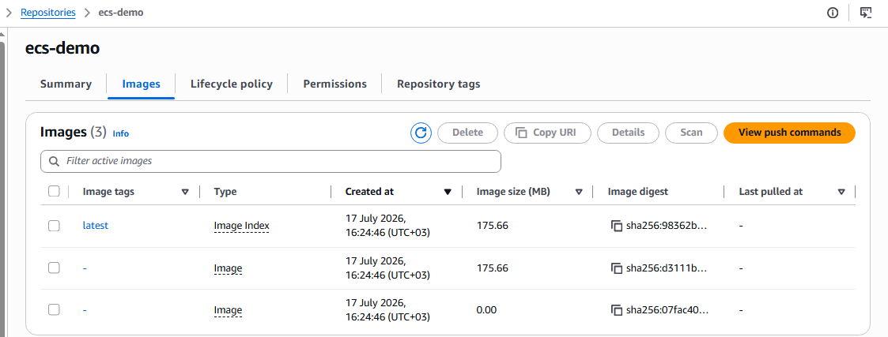

### Step 8 — Store the secret in Secrets Manager
AWS Console → **Secrets Manager** → Store a new secret → *Other type of secret*
- Key: `DB_PASSWORD`
- Value: `MyPassword@123`
- Secret name: `ecs-db-secret`

> secret created in Secrets Manager
> 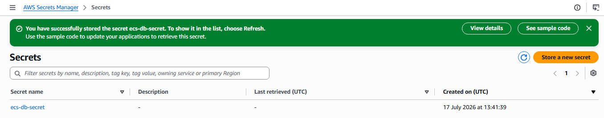

### Step 9 — Create the ECS cluster
AWS Console → **ECS** → Clusters → Create Cluster
- Name: `training-cluster`
- Infrastructure: **AWS Fargate**

> Cluster overview
> 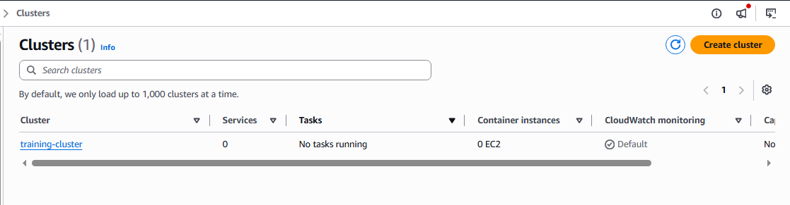

### Step 10 — Create the Task Definition (multi-container)

**Task-level configuration**
| Field | Value |
|---|---|
| Task definition family | `ecs-demo-task` |
| Launch type | `AWS Fargate` |
| Operating system/architecture | `Linux/X86_64` |
| Network mode | `awsvpc` (required for Fargate) |
| Task CPU | `0.5 vCPU` |
| Task memory | `1 GB` |
| Task role | *(none required for this demo — no in-app AWS API calls)* |
| Task execution role | `ecsTaskExecutionRole` |
 
**Container 1 — `apache`**
| Field | Value |
|---|---|
| Image | `<ECR image URI>` |
| Port | 80 |
| Environment variable | `APP_NAME = Training Portal` |
| Secret | `DB_PASSWORD → ecs-db-secret` |

> Configure db scret as enviroment variables
> 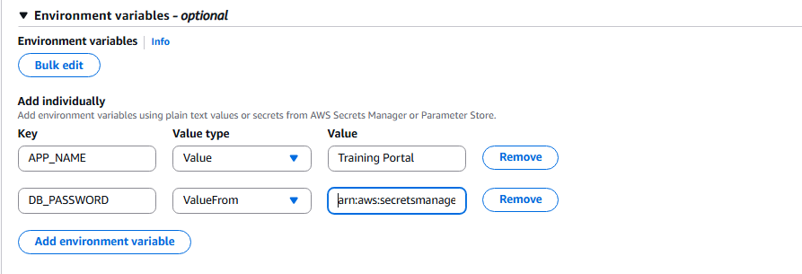

 
**Container 2 — `helper` (sidecar)**
 
In the console, click **Add container** a second time inside the same task definition, then fill in:
 
| Field | Value | Notes |
|---|---|---|
| Container name | `helper` | |
| Image URI | `busybox` | Pulled directly from Docker Hub — no ECR push needed for this one |
| Essential container | **Off / unchecked** | Recommended for a sidecar — if `helper` crashes, the task keeps running instead of taking `apache` down with it |
| Port mappings | *(leave empty)* | The helper doesn't listen on any port |
| Environment variables | *(none)* | Not needed for this container |
| Command override | `sh,-c,while true; do echo "Helper Running"; sleep 20; done` | Console command fields are comma-separated — this reproduces `sh -c "..."` as three separate arguments |
| CPU / Memory (soft/hard limits) | *(leave empty)* | Falls back to sharing the task-level 0.5 vCPU / 1 GB pool |
| Log collection | Enable (defaults to `awslogs` → CloudWatch) | Lets you see "Helper Running" appear every 20 seconds in CloudWatch Logs — useful for confirming it's alive |

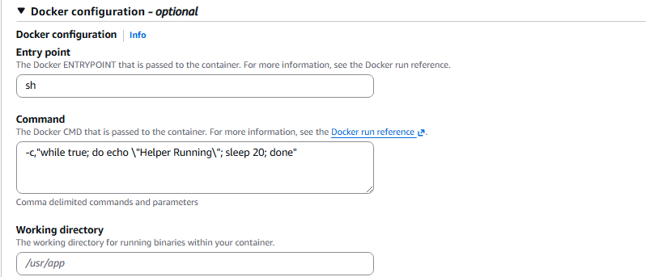
 
> **Where to find these fields:** inside the `helper` container's settings, scroll past **Environment variables** to the **Docker configuration** section — that's where **Entry point**, **Command**, and **Working directory** live (a separate section, not part of the environment variables table).
 
>  **Command vs Entrypoint:** leave "Entrypoint" empty here and only set "Command" — this overrides the default `CMD` of the `busybox` image without touching its `ENTRYPOINT`. If you needed to override both, you'd fill in Entrypoint too, but this image doesn't require it.
 
>  Task CPU/memory (0.5 vCPU / 1 GB) is split across both containers combined — Fargate doesn't let you assign CPU/memory per-container unless you explicitly set limits on each. For this demo, leaving per-container limits unset lets both containers share the task-level pool.

Task definition showing both containers configured: Container1
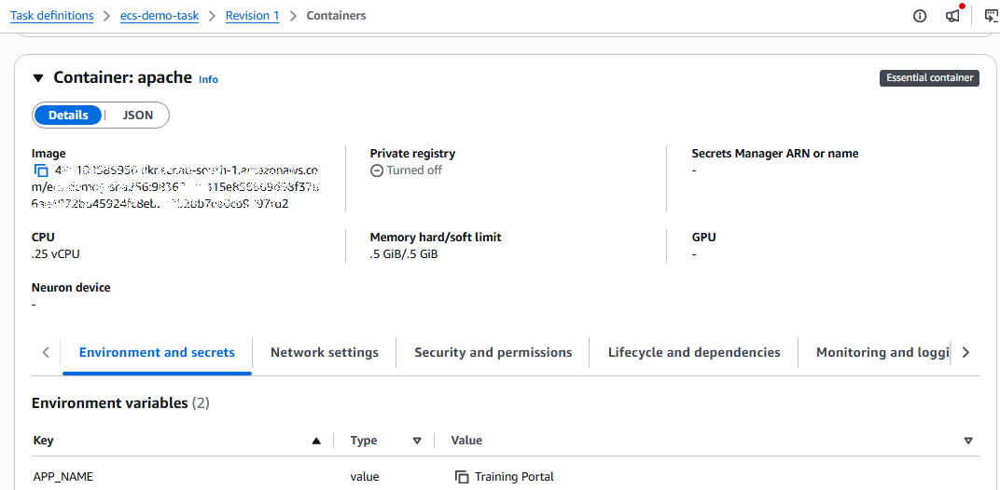

Task definition showing both containers configured: Container2
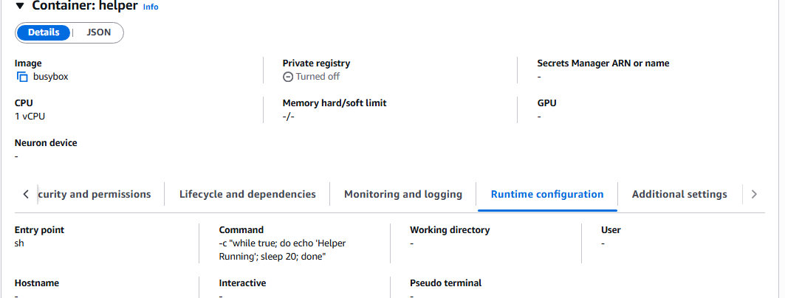

### Step 11 — Create an Application Load Balancer
- Internet-facing
- Listener: HTTP:80
- At least 2 public subnets
- Security group: allow HTTP 80 from anywhere

### Step 12 — Create a Target Group
- Target type: **IP**
- Protocol: HTTP, Port 80
- Health check path: `/`

> ALB listener and target group configuration
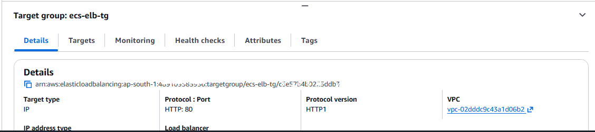

> Active state
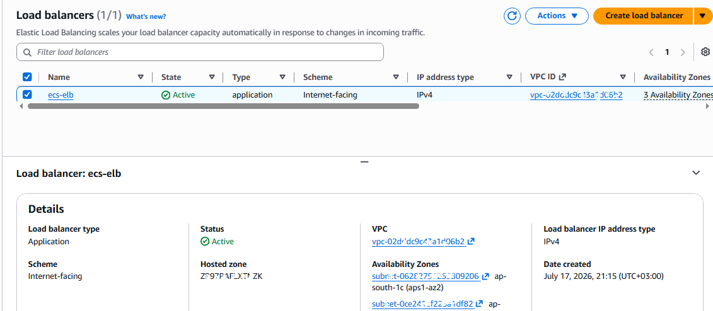

### Step 13 — Create the ECS Service
- Cluster: `training-cluster`
- Task Definition: `ecs-demo-task`
- Desired count: `2`
- Networking: same VPC, public subnets, auto-assign public IP (lab setting only)
- Load balancer: attach the ALB, listener, and target group from Steps 11–12

### Step 14 — Wait for deployment
Confirm both tasks (each running `apache` + `helper`) reach the **Running** state.

> ECS service showing 2/2 tasks running
> 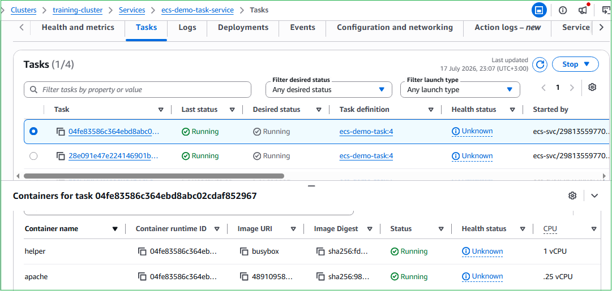


### Step 15 — Verify via the ALB
Open the ALB's DNS name in a browser. Refresh repeatedly — the **Hostname** value should change as the ALB load-balances between tasks.

App output via ALB DNS (capture two refreshes to show the hostname change)
> 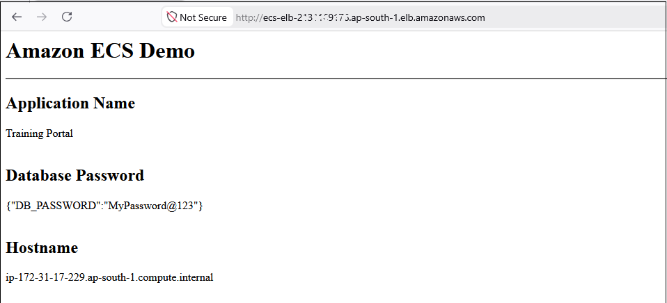

After refresh - notice hostname change
> 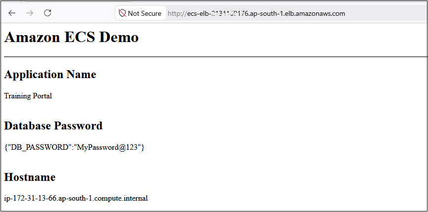

---

## Troubleshooting: Fixing Secrets Manager Access

If the container fails to start or can't retrieve `DB_PASSWORD`, the **Execution Role** likely lacks permission.

1. IAM → Roles → search `ecsTaskExecutionRole`
2. Confirm it only has `AmazonECSTaskExecutionRolePolicy` (does **not** grant secret access by default)
3. Add an inline policy:
```json
{
  "Version": "2012-10-17",
  "Statement": [
    {
      "Effect": "Allow",
      "Action": ["secretsmanager:GetSecretValue"],
      "Resource": "arn:aws:secretsmanager:<region>:<account-id>:secret:ecs-db-secret-*"
    }
  ]
}
```
> Use a trailing `-*` since AWS appends a random suffix to secret ARNs.

4. Name the policy (e.g., `SecretsManagerAccess`) and create it
5. Go to ECS → Cluster → Service → **Update Service** → **Force new deployment** (no other changes needed)

>  Inline policy attached to `ecsTaskExecutionRole`
> 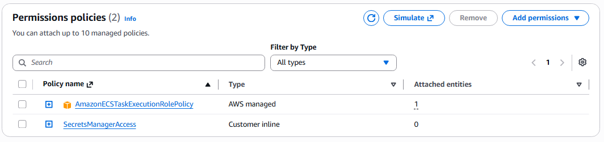


---

## Real Errors Hit During This Deployment
 
These are actual failures encountered while building this project, kept here because working through them is a bigger part of the learning than the happy path.
 
### 1. Deployment rolled back — "circuit breaker was triggered"
**Symptom:** CloudFormation/service banner: `Error occurred during operation 'ECS Deployment Circuit Breaker was triggered'`, cluster shows 0 running tasks.
**Cause:** ECS kept trying to start tasks, they kept failing, and after enough consecutive failures the circuit breaker auto-rolled back the deployment to protect you from an infinite failure loop.
**Fix:** This is a symptom, not the root cause — check **Tasks → Stopped tasks → Stopped reason** for the actual underlying error, fix that, then redeploy.
 
### 2. `AccessDeniedException` on `ssm:GetParameters`
**Symptom:**
```
unable to retrieve secrets from ssm: ... AccessDeniedException: ... is not authorized to perform: ssm:GetParameters on resource: arn:aws:ssm:...:parameter/ecs-db-secret
```
**Cause:** The `DB_PASSWORD` secret's `ValueFrom` was set to just the plain secret name (`ecs-db-secret`). ECS decides which service to call based on the string format — since it didn't start with `arn:aws:secretsmanager:...`, ECS assumed it was an **SSM Parameter Store** name instead of a Secrets Manager secret.
**Fix:** Use the **full Secrets Manager ARN**, plus the JSON key suffix if the secret is a key-value pair:
```
arn:aws:secretsmanager:<region>:<account-id>:secret:ecs-db-secret-AbCdEf:DB_PASSWORD::
```
 
### 3. `helper` container exits with code 2
**Symptom:** Container details show `Exit code: 2`, and the **Command** field shows something like `["-c \"while true; do echo 'Helper Running'; sleep 20; done\""]`.
**Cause:** Two console gotchas stacked together:
- **Entry point** and **Command** are separate fields under **Docker configuration** (not one combined field, and not part of Environment variables) — `sh` needs to go in Entry point, not bundled into Command.
- Typing the whole Command value wrapped in quotes (`"..."`) bakes literal `"` characters into the string instead of just splitting on commas, producing a malformed command busybox can't execute.
**Fix:** Entry point: `sh`. Command (comma-delimited, no wrapping quotes): `-c,while true; do echo "Helper Running"; sleep 20; done`

---

## Validation Checklist

- [ ] Local Docker container runs and displays env vars correctly
- [ ] Image pushed to ECR successfully
- [ ] Secret created in Secrets Manager
- [ ] ECS cluster, task definition (2 containers), and service created
- [ ] ALB routes traffic and health checks pass
- [ ] Refreshing the page shows different hostnames (load balancing confirmed)
- [ ] Manually stopping a task triggers automatic replacement (self-healing confirmed)
- [ ] Execution Role has explicit `secretsmanager:GetSecretValue` permission

---

## Cleanup (avoid ongoing charges)
- Delete the ECS Service → Cluster
- Deregister old Task Definitions (optional)
- Delete the ALB and Target Group
- Delete the ECR repository/image
- Delete the secret in Secrets Manager
- Delete the inline IAM policy if no longer needed

---

## What I Learned

- The difference between **Task Role** and **Execution Role** and when each applies — reinforced firsthand when a `secretsmanager:GetSecretValue` AccessDenied error turned out to be an Execution Role gap (ECS retrieving the secret before the app starts), not a Task Role one (which would only matter if the app itself called AWS APIs at runtime)
- Why hardcoding secrets (in code, Dockerfile, or plain task definition env vars) is insecure
- How to implement the **sidecar container pattern** for auxiliary/background processes
- How ECS Fargate + ALB provide automatic scaling, healing, and traffic distribution
- How to debug real-world IAM permission issues tied to Secrets Manager

---

## Author

**Sinsha C**

[](https://github.com/sinsha-c)
[](https://linkedin.com/in/sinshac)

---